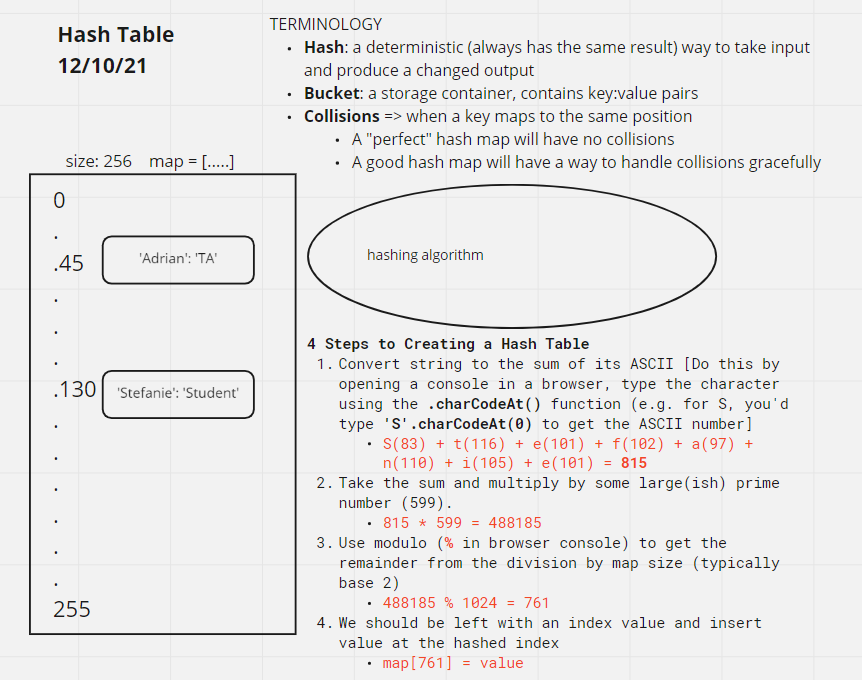

# Hash Tables

<!-- Short summary or background information -->

## Challenge

-   **Use Branch Name**: `hashtable`
-   **Challenge Type**: New Implementation

## Features

Implement a Hashtable Class with the following methods:

-   **add**
    -   Arguments: key, value
    -   Returns: nothing
    -   This method should hash the key, and add the key and value pair to the table, handling collisions as needed.
-   **get**
    -   Arguments: key
    -   Returns: Value associated with that key in the table
-   **contains**
    -   Arguments: key
    -   Returns: Boolean, indicating if the key exists in the table already.
-   **hash**
    -   Arguments: key
    -   Returns: Index in the collection for that key

## Testing

1. Adding a key/value to your hashtable results in the value being in the data structure
1. Retrieving based on a key returns the value stored
1. Successfully returns null for a key that does not exist in the hashtable
1. Successfully handle a collision within the hashtable
1. Successfully retrieve a value from a bucket within the hashtable that has a collision
1. Successfully hash a key to an in-range value

## Miro

